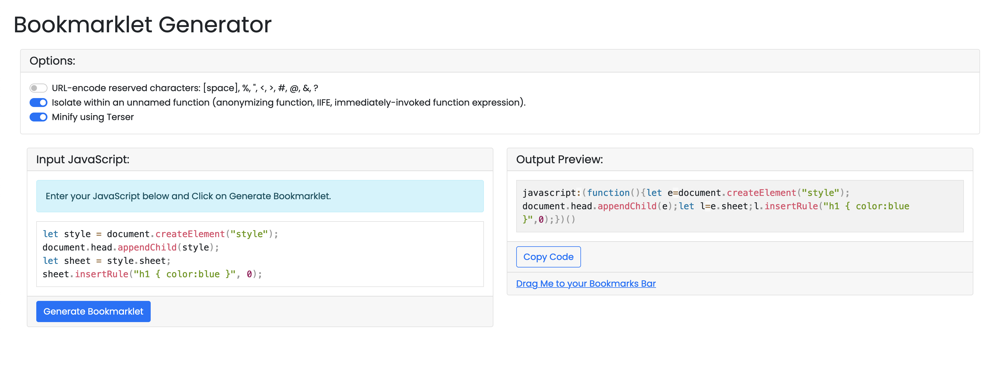

# Bookmarklet Manager

React based web app to convert a JavaScript snippet into a Bookmarklet

# Local Development

- Clone the repo
- Install dependencies `npm install`
- Start server `npm run start`
